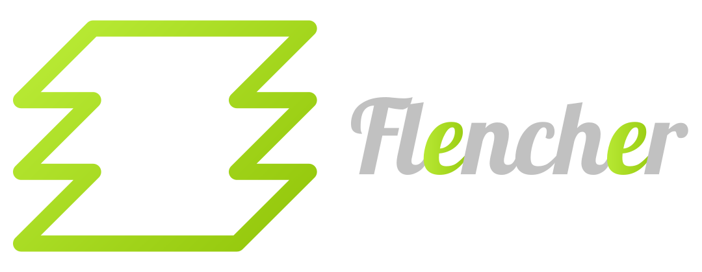

# Welcome to Flencher CLI

Flencher is a CLI to start a **[Stencil](https://stenciljs.com/)** project including some useful features.

## Legend

- [Installation](#installation)
- [Utilization](#utilization)
- [Flags](#flags)
- [Features](#features)
- [Credits](#credits)

## Wording

- **Components**: Organisms, molecules, atoms type of architectural parts
- **Containers**: Pages, templates type of architectural parts

# Installation

You can install the CLI using:

```
npm i -g @flowrome/flencher
```

# Utilization

To use Flencher CLI you can either launch:

```
npx @flowrome/flencher [+flags]
```

Or if you have installed that globally

```
flencher [+flags]
```

# Options `--flag`

- **[Create a project or a component](#create-a-project-or-a-component)** `--td=createProject`

  - [project](#project-creation) `--t=project`
    - starter `--st=component|ionic-pwa|app`
    - name `--n=|string|`
    - prefix `--pr=|string|` **_default='fl'_**
    - router `--rt=yes|no` **_default='yes'_**
    - shadow `--sd=yes|no` **_default='yes'_**
    - storybook `--sb=yes|no` **_default='yes'_**
    - UNIT tests `--unit=yes|no` **_default='yes'_**
    - e2e tests `--e2e=yes|no` **_default='yes'_**
  - [atom](#atom-) `--t=atom`
    - name `--n=|string|`
  - [molecule](#molecule-) `--t=molecule`
    - name `--n=|string|`
  - [organism](#organism-) `--t=organism`
    - name `--n=|string|`
  - [template](#template-) `--t=template`
    - name `--n=|string|`
  - [page](#page-) `--t=page`
    - name `--n=|string|`

- **[Execute a script](#execute-a-script)** `--td=executeScript`

  - [colors](#colors-) `--scr=colors`

# Features

## Create a project or a component

If you choose this option you'll enter in the **Creation Flow**, here you can create an entire project or, **if you're already inside a flencher project**, an atom, a molecule, an organism, a template, or a page.

**\* ONLY AVAILABLE INSIDE A FLENCHER PROJECT**

### Project creation

This will start the creation of the **Flencher** project scaffold, it will ask some questions to include/exclude some features:

- starter: you can choose one of these: component|ionic-pwa|app, it will start the stencil project with the desired starter ([Documentation](https://stenciljs.com/docs/getting-started))
- name: name of the project (**It is very recommended to use kebab case for your project name (Ex: test-project)**)
- prefix: prefix for your components, each time you create a component his tag will be:

```jsx
<`${prefix}-${componentName}`></`${prefix}-${componentName}`>
```

- router: it will include/exclude the [routing](https://github.com/ionic-team/stencil-router) library

```json
{
  ...
  "dependencies"{
    ...
    "@stencil/router": "x"
  }
}
```

- shadow: components will be created with/without shadow dom:

```typescript
@Component({
  tag: 'component-tag',
  styleUrl: 'component.scss',
  shadow: true|false,
})
```

- storybook: in the project scaffold there will be some files to manage the storybook part with also starter scripts, when you create a component it will add a `.stories` file, also it will include these devDependencies:

```json
{
  ...
  "devDependencies"{
    ...
    "@storybook/html": "x",
    "@storybook/addon-essentials": "x",
    "copy-webpack-plugin": "x",
    "write-file-webpack-plugin": "x",
  }
}
```

- Unit test: It will create `.spec` files when you create a component or a container
- e2e test: It will create `.e2e` files when you create a component or a container

**Project structure**

The project will be created using a revisited atomic pattern, so you will have this main folders:

- atoms
- molecules
- organisms
- templates
- pages

Each of these folders will be populated when you create a **component** or a **container**

Keep in mind that this structure is only a suggestion, you can use whatever architectural pattern you want, but you may encounter some issue while using the rest of the options given by the flencher CLI.
Also if you do not use any of the previous folders, you can delete them if you like.

The project will have this structure:

```
...to insert tree
```

**Themes**:
Inside the file flencher.json there is the key:

```json
{
  ...
  "theme-colors": {
    ...
  }
}
```

Here you can define any color you want to generate a theme inside your `src/styles/theme` folder, the only color that are required to be there are:

- light
- dark
- background-light
- background-dark

You can change their values, but the keys should be there, if not it is possible that there will be missing keys inside the files undes `src/styles/theme` folder.

If you want to add other colors just insert the key and the value in the JSON like this:

```json
{
  ...
  "theme-colors": {
    ...
    "color-name": "#color-value" // MUST BE HEXADECIMAL
  }
}
```

You can check [here](./docs/css-theme-generator.doc.md), for an example of the `.scss` files that will be generate by the [script](#colors-)

### Atom \*

If you choose this option, it will be created an atom in your project with the given name, according this scaffold pattern the atom are the at \***\*lowest\*\*** level of development, for example a **button**, the **typographies** or an **input field**.
This is the structure that the component will have:

```
...
[atom-name].atom
  [atom-name].atom.e2e.ts // the files that contains the e2e tests (Only present if e2e option is true)
  [atom-name].atom.scss // scoped or shadowed scss of the component
  [atom-name].atom.spec.ts // the files that contains the UNIT tests(Only present if unit option is true)
  [atom-name].atom.stories.js // the file that contains the storybook stories (Only present if storybook option is true)
  [atom-name].atom.tsx // the ts component file where to describe your stencil component
  [atom-name].atom.vars.scss // this file will be injected in the global styles file and should contain all the scoped variables for the component
...
tag: [prefix]-[atom-name]-atom
```

### Molecule \*

If you choose this option, it will be created a molecule in your project with the given name, according this scaffold pattern the molecules are composed by **more than one atom**, for example a **button list**, a **tab group** or a **form**.
This is the structure that the component will have:

```
...
[molecule-name].molecule
  [molecule-name].molecule.e2e.ts // the files that contains the e2e tests (Only present if e2e option is true)
  [molecule-name].molecule.scss // scoped or shadowed scss of the component
  [molecule-name].molecule.spec.ts // the files that contains the UNIT tests(Only present if unit option is true)
  [molecule-name].molecule.stories.js // the file that contains the storybook stories (Only present if storybook option is true)
  [molecule-name].molecule.tsx // the ts component file where to describe your stencil component
  [molecule-name].molecule.vars.scss // this file will be injected in the global styles file and should contain all the scoped variables for the component
...
tag: [prefix]-[molecule-name]-molecule
```

### Organism \*

If you choose this option, it will be created an organism in your project with the given name, according this scaffold pattern the organisms are composed by **more than one molecule or atom**, for example a **modal**, a **card** or a **carousel**.
This is the structure that the component will have:

```
...
[organism-name].organism.molecule
  [organism-name].organism.molecule.e2e.ts // the files that contains the e2e tests (Only present if e2e option is true)
  [organism-name].organism.molecule.scss // scoped or shadowed scss of the component
  [organism-name].organism.molecule.spec.ts // the files that contains the UNIT tests(Only present if unit option is true)
  [organism-name].organism.molecule.stories.js // the file that contains the storybook stories (Only present if storybook option is true)
  [organism-name].organism.molecule.tsx // the ts component file where to describe your stencil component
  [organism-name].organism.molecule.vars.scss // this file will be injected in the global styles file and should contain all the scoped variables for the component
...
tag: [prefix]-[organism-name]-organism
```

### Template \*

If you choose this option, it will be created a template in your project with the given name, according this scaffold pattern the templates are directly below the pages, and they should contain all the components that are present in the current-page, for example a **tab content**
This is the structure that the component will have:

```
...
[template-name].template.molecule
  [template-name].template.molecule.e2e.ts // the files that contains the e2e tests (Only present if e2e option is true)
  [template-name].template.molecule.scss // scoped or shadowed scss of the component
  [template-name].template.molecule.spec.ts // the files that contains the UNIT tests(Only present if unit option is true)
  [template-name].template.molecule.stories.js // the file that contains the storybook stories (Only present if storybook option is true)
  [template-name].template.molecule.tsx // the ts component file where to describe your stencil component
  [template-name].template.molecule.vars.scss // this file will be injected in the global styles file and should contain all the scoped variables for the component
...
tag: [template-name]-template
```

### Page \*

If you choose this option, it will be created a page in your project with the given name, according this scaffold pattern the pages are the one that you should use in your routing as landing components, they can contain at the same time a sub-navigation routing, and they should contain **one or more templates**
This is the structure that the component will have:

```
...
[page-name].page.molecule
  [page-name].page.molecule.e2e.ts // the files that contains the e2e tests (Only present if e2e option is true)
  [page-name].page.molecule.scss // scoped or shadowed scss of the component
  [page-name].page.molecule.spec.ts // the files that contains the UNIT tests(Only present if unit option is true)
  [page-name].page.molecule.stories.js // the file that contains the storybook stories (Only present if storybook option is true)
  [page-name].page.molecule.tsx // the ts component file where to describe your stencil component
  [page-name].page.molecule.vars.scss // this file will be injected in the global styles file and should contain all the scoped variables for the component
...
tag: [page-name]-page
```

## Execute a script

### Colors \*

# Credits
